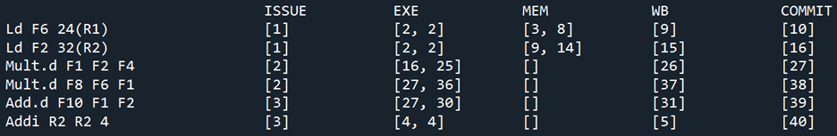

## Tomasulo Algorithm Simulation
* includes instructions of int_add, fp_add, fp_multi, load, store, branch;
* implements ROB, RAT, load-store-queue;
* implements out-of-order processing and memory disambiguation; 
* doesn't include branch prediction.
* Add "Issue_width"

## How to run
```
cd code
python main.py
```


# Code Modification
* To test the example, I've changed several parameters in the code

||# of rs|Cycles in EX|Cycles in Mem|# of FUs|
|-|-|-|-|-|
|Integer adder|1|1||1|
|FP adder|2|4||1|
|FP multiplier|2|10||1|
|Load/store unit|2|10|6|1|

* The instructions in file "test_case.in"  
Ld F6 24(R1)  
Ld F2 32(R2)  
Mult.d F1 F2 F4  
Mult.d F8 F6 F1  
Add.d F10 F1 F2  
Addi R2 R2 4  
* <b style='color:red'>I did not change the code to commit multiple instructions in each clock cycle</b>, so the commit value of my result will be different to the result in the example slide

## Result
### Issue width 1

### Issue width 2

### Issue width 3

### Issue width 4


## Report
[Report](Report.pdf)
